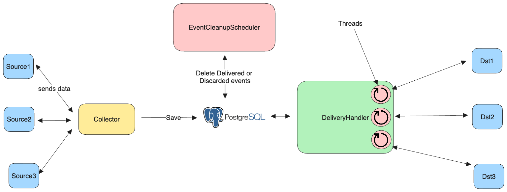

### Prerequisite

* postgresql
* mvn cli

### Build Setup

1. **Using Docker compose**
* build package

 
    mvn clean package -DskipTests

* Build and run java_app

    
    docker compose up java_app

2. **Manual setup**

* start postgresql

    brew services start postgresql;

* change user and db in application.properties

        spring.datasource.url=jdbc:postgresql://<host>:<port>/<db>
        spring.datasource.username=<username>
        spring.datasource.password=<password>

* Build application.jar file

        mvn clean install

* Add destination
    
    
        curl -X POST -H "Content-Type: application/json" -d '{
            "destinationId":"<destinationId>",
            "endPoint": "<destinationUrl>",
            "retryCount": 0,
            "retryThreshold": 10,
            "retryTimeout": 20000}' http://localhost:8080/api/destination-config/add

* Map source-destinations

        curl -X POST -H "Content-Type: application/json" -d '{
          "sourceId": "<sourceId>",
          "destinationId": "<destinationId>"
          }' http://localhost:8080/api/source-destination/add

        
* Send event

    
        curl -X POST -H "Content-Type: application/json" -d '{"sourceId":"src1","payload":"Hello Destinations !!!"}' http://localhost:8080/api/event/send

* run jar file

        java -jar ./target/event-streaming-0.0.1-SNAPSHOT.jar

### Architecture

### Features
* Sender can send events to multiple specific the destinations
* All events will be sent in FIFO order
* Once event ingested, it will be available in system in case of application crash
* All the destinations can be configured for retry in isolation
* Easy to support and configure new destination
* At least once delivery ensured
* Better performance of Reactive send event api using webflux

